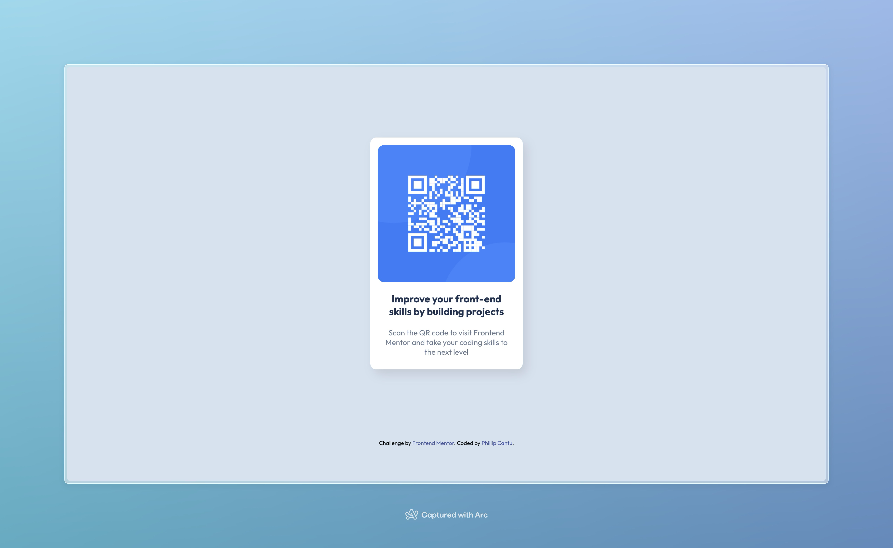

# Frontend Mentor - QR code component solution

This is a solution to the [QR code component challenge on Frontend Mentor](https://www.frontendmentor.io/challenges/qr-code-component-iux_sIO_H). Frontend Mentor challenges help you improve your coding skills by building realistic projects.

## Table of contents

- [Overview](#overview)
  - [Screenshot](#screenshot)
  - [Links](#links)
- [My process](#my-process)
  - [Built with](#built-with)
  - [What I learned](#what-i-learned)
  - [Continued development](#continued-development)
  - [Useful resources](#useful-resources)
- [Author](#author)
- [Acknowledgments](#acknowledgments)

## Overview

### Screenshot



### Links

- Solution URL: [https://github.com/hereisphil/FEM-QR_Code_Challenge](https://github.com/hereisphil/FEM-QR_Code_Challenge)
- Live Site URL: [https://hereisphil-fem-qrcodechallenge.netlify.app/](https://hereisphil-fem-qrcodechallenge.netlify.app/)

## My process

### Built with

- Semantic HTML5 markup
- CSS custom properties
- Flexbox

### What I learned

Honestly, what I learned the most is that I really need to study and practice more on centering and the use of flex box.

For example my solution contains:

```html
<body>
  <div class="wrapper">...</div>
</body>
```

and I'm uncertain if wrapping the entire page within a <div> element just apply the following CSS:

```
/* Center Content */
.wrapper {
  display: flex;
  flex-direction: column;
  justify-content: center;
  align-items: center;
  height: 90vh;
}
```

is considered modern best practices. I'd love feedback on this. Secondly, I didn't apply any media queries for responsiveness because I found the site to be quite responsive already. Perhaps I didn't do enough testing? Please let me know.

Overall though, I am proud of my solution, especially with the fact that I didn't use ChatGPT at all 😆 I did have to play around a bit with the CSS and I only had to look up box-shadow properties.

### Continued development

FOCUS ON: CSS + Flex Box

### Useful resources

- [W3 Schools Box Shadow](https://www.w3schools.com/css/css3_shadows_box.asp) - I used this to remind me that the properties are: horizontal, vertical, blur, spread, color.

## Author

- GitHub - [@hereisphil](https://github.com/hereisphil)
- Frontend Mentor - [@hereisphil](https://www.frontendmentor.io/profile/hereisphil)
- Instagram - [@philtheotaku](https://www.instagram.com/philtheotaku/)

## Acknowledgments

[Full Sail University](https://www.fullsail.edu/) - at the time of writing this README.md I'm a full time [web development student](https://www.fullsail.edu/degrees/web-development-bachelor) at one of the USA's top universities. If you're considering getting a degree in web development, I say look no further than Full Sail! It's fully online and it's fast-paced. Starting from scratch a bachelor's takes 27 months to complete! Check out the program here: [https://www.fullsail.edu/degrees/web-development-bachelor](https://www.fullsail.edu/degrees/web-development-bachelor)
